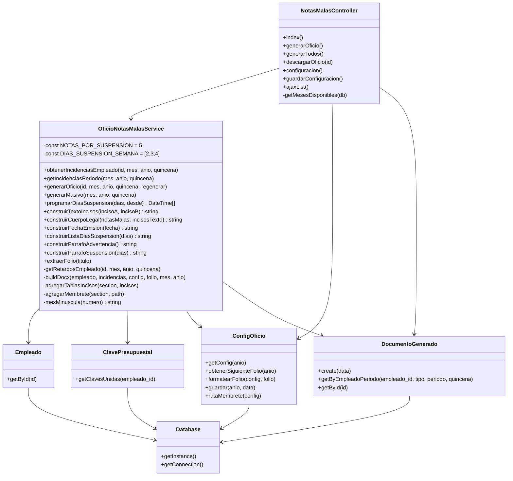
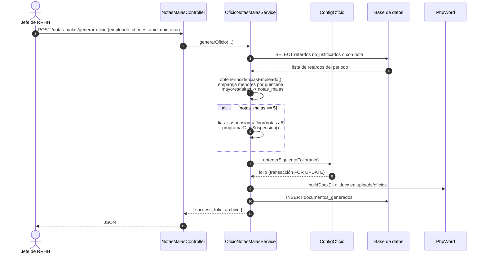
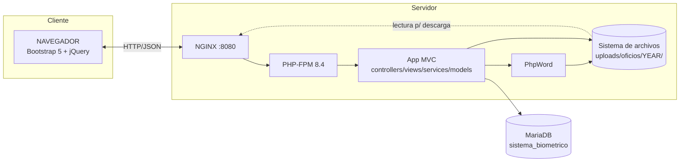
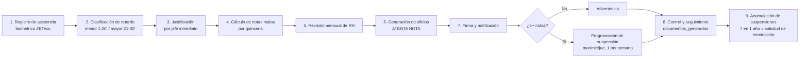

# Arquitectura del Módulo de Notas Malas y Oficios "ATENTA NOTA"

> Documento de arquitectura y ciclo de vida del software del módulo de notas malas.
> Reglas extraídas del oficio de referencia: `docs/notas malas ABRIL 2026 laura.docx`
> (sección "Comentarios" y textos de cada oficio).

---

## 1. Contexto y reglas de negocio

Las notas malas se generan a partir de los retardos **no justificados** y de los
retardos justificados que **exceden los 2 permitidos por quincena** (los excedentes
ya no se pueden justificar y generan nota).

| Regla | Descripción |
|---|---|
| **Inciso a) Retardo menor** | Retraso de 1 a 20 minutos. Si no está justificado, cada **2 dentro de la misma quincena** se convierten en 1 nota mala. |
| **Inciso b) Retardo mayor** | Retraso de 21 a 30 minutos. Si no está justificado, genera **1 nota mala inmediata**. |
| **Cuota de justificados** | Se permiten **2 retardos justificados por quincena** sin nota; el 3ro en adelante se convierte en nota. |
| **Suspensión** | Al acumular **5 notas malas en 1 mes** corresponde **1 día de suspensión**. |
| **Programación de suspensión** | Las suspensiones solo aplican **martes, miércoles o jueves**, una por semana, en semanas distintas y nunca en días consecutivos. |
| **Texto del oficio** | Cita los Art. 70, 71 Fracc. II, 74, 76 y **80 inciso a)/b)** del Reglamento de la SEP. La advertencia se emite con menos de 5 notas; con 5+ se emite la suspensión (Art. 80 inciso d)). |

---

## 2. Arquitectura en capas

El módulo sigue la arquitectura MVC del proyecto (PHP 8.4 sin framework).

```
┌─────────────────────────────────────────────────────────────┐
│ Vista (Bootstrap 5 / jQuery)                                │
│  NotasMalasController construye HTML; AJAX -> JSON          │
└───────────────────────────┬─────────────────────────────────┘
                            │ HTTP (JSON)
┌───────────────────────────▼─────────────────────────────────┐
│ Controlador                                                │
│  NotasMalasController                                      │
│   index · generarOficio · generarTodos · descargarOficio   │
│   configuracion · guardarConfiguracion · ajaxList          │
└───────────────────────────┬─────────────────────────────────┘
                            │
┌───────────────────────────▼─────────────────────────────────┐
│ Servicio (reglas de negocio)                               │
│  OficioNotasMalasService                                   │
│   obtenerIncidenciasEmpleado · getIncidenciasPeriodo        │
│   programarDiasSuspension · generarOficio · generarMasivo   │
│   buildDocx (PhpWord)                                       │
└───────────────────────────┬─────────────────────────────────┘
                            │
┌───────────────────────────▼─────────────────────────────────┐
│ Modelos (persistencia)                                     │
│  Database · Empleado · ClavePresupuestal · ConfigOficio     │
│  PlantillaDocumento (DocumentoGenerado)                     │
└─────────────────────────────────────────────────────────────┘
```

---

## 3. Diagrama de casos de uso

```mermaid
flowchart LR
    subgraph RH["Recursos Humanos"]
        A[Jefe de RRHH / Admin]
        B[Superadmin]
    end

    UC1(("Consultar notas malas e incidencias"))
    UC2(("Generar oficio individual"))
    UC3(("Generar oficios masivos ZIP"))
    UC4(("Descargar oficio"))
    UC5(("Regenerar oficio con nuevo folio"))
    UC6(("Configurar oficio folio/firma/membrete"))

    A --> UC1
    A --> UC2
    A --> UC3
    A --> UC4
    A --> UC5
    A --> UC6
    B --> UC6

    UC1 ..> UC2 : <<include>>
    UC2 ..> UC4 : <<include>>
    UC3 ..> UC2 : <<include>>
```

---

## 4. Diagrama de clases



---

## 5. Diagrama de secuencia: generación de un oficio



---

## 6. Diagrama de actividad: cálculo de notas malas y suspensión

```mermaid
flowchart TD
    A[Inicio: empleado + periodo] --> B{¿Retardos en el periodo?}
    B -- No --> N[null: sin incidencias]
    B -- Sí --> C[Clasificar cada retardo]
    C --> D{Tipo}
    D -- retardo_menor --> E{Sin justificar?}
    D -- retardo_mayor --> F[1 nota mala]
    D -- falta --> F
    E -- Sí --> G1[Pool menores sin justificar por quincena]
    E -- No (justificado con nota) --> G2[Pool menores exceso por quincena]
    G1 --> H[Por quincena: floor(n/2) notas]
    G2 --> H
    H --> I[notas_malas = notas menores + mayores + faltas]
    F --> I
    I --> J{notas_malas >= 5?}
    J -- No --> K[Oficio con ADVERTENCIA]
    J -- Sí --> L[dias = floor(notas_malas / 5)]
    L --> M[Programar dias: mar/mie/jue,<br/>1 por semana, no consecutivos]
    M --> O[Oficio con SUSPENSIÓN]
    K --> P[Generar .docx PhpWord]
    O --> P
    P --> Q[Registrar en documentos_generados]
    Q --> R[Fin]
```

---

## 7. Diagrama de componentes y despliegue



---

## 8. Ciclo de vida del software (proceso de negocio)



---

## 9. Decisiones técnicas relevantes

1. **Emparejamiento por quincena**: `obtenerIncidenciasEmpleado()` separa los retardos
   menores en los dos pools (sin justificar y exceso de justificados) y aplica
   `floor(n/2)` **dentro de cada quincena**, tal como indica el documento de referencia.
2. **Suspensiones múltiples**: `programarDiasSuspension()` calcula `floor(notas/5)`
   días y los programa en martes/miércoles/jueves, uno por semana ISO distinta
   (nunca días consecutivos). El texto del oficio usa singular/plural automáticamente.
3. **Cuota de justificados**: la detección de "exceso de justificados" se apoya en los
   registros de `notas_malas` (creados por `JustificacionController` y
   `scripts/recalcular_notas_malas_quincena.php`); el servicio solo los incluye en el
   oficio si tienen nota registrada. Desde la mejora profunda, tanto
   `JustificacionController::crearNotaMala()` como el script de recálculo emparejan por
   **quincena** (rango 1-15 / 16-fin de mes), y el script también genera las notas de los
   retardos **no justificados** (2 menores = 1 nota, cada mayor = 1 nota) con la misma
   regla, manteniendo la tabla `notas_malas` consistente con el servicio.
4. **Folio atómico**: `ConfigOficio::obtenerSiguienteFolio()` usa `SELECT ... FOR UPDATE`
   dentro de una transacción para evitar folios duplicados.
5. **Documentos versionados**: cada oficio se registra en `documentos_generados`
   (tipo `oficio_notas_malas`) con periodo y quincena, y el folio queda en el título.
6. **Texto del oficio como funciones puras**: las reglas de texto (`construirCuerpoLegal`,
   `construirParrafoAdvertencia`, `construirParrafoSuspension`, `construirFechaEmision`,
   `construirListaDiasSuspension`) son métodos públicos estáticos y testeables sin
   dependencia de PhpWord ni de la BD; `buildDocx` solo las ensambla.
7. **Pie de página institucional**: el docx incluye footer con la dirección
   (Colegio Salesiano 42, Colonia Anáhuac I Secc, C.P. 11320 CDMX) y el dominio
   `www.gob.mx/aefcm`, replicando el formato del documento de referencia.
8. **Formato de fechas de suspensión**: el mes se escribe en **minúsculas**
   ("el día 11 de agosto"), como en el oficio oficial, mientras la fecha de emisión
   conserva mayúscula inicial ("Ciudad de México, a 9 de Agosto de 2026").
