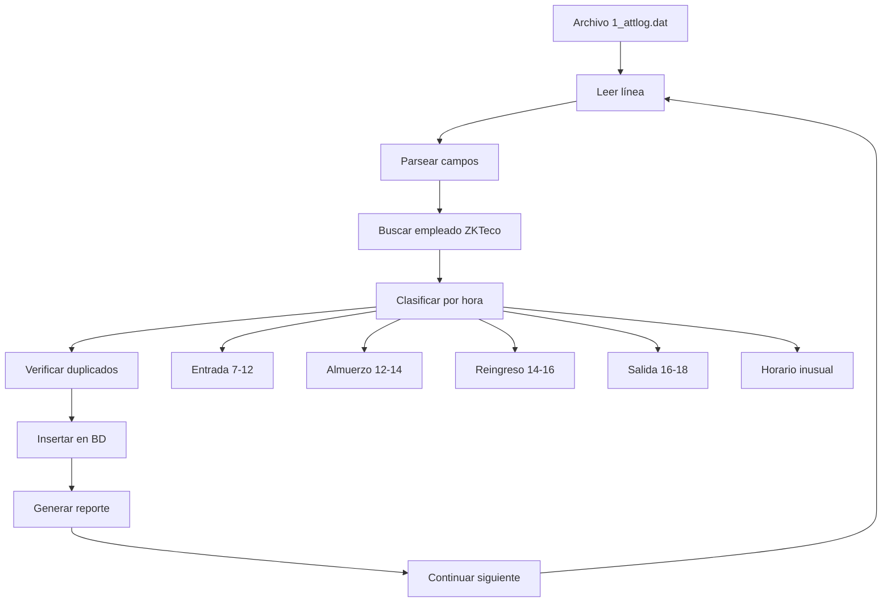

# ANÁLISIS DETALLADO DEL ARCHIVO ZKTeco 1_attlog.dat

## 📊 RESUMEN GENERAL
- **Total de registros**: 19,583
- **Rango de fechas**: 21/01/2025 15:00:07 a 14/01/2026 09:10:41
- **Periodo cubierto**: Casi 1 año completo de actividad
- **Usuarios únicos**: 215 empleados diferentes registrados

## 🔍 ESTRUCTURA DETALLADA DEL ARCHIVO

### Formato por Registro
```
[ID_Usuario]    [Fecha-Hora]    [Campo1]    [Campo2]    [Campo3]    [Campo4]
2603            2025-01-21 15:00:07     1             0             1             0
```

### 📋 Análisis de Campos

#### **Campo 1: ID Usuario (Posición 1)**
- **Rango**: 62 a 2632
- **Usuarios más activos** (Top 5):
  - ID 210: 835 registros
  - ID 263: 678 registros  
  - ID 634: 636 registros
  - ID 2621: 632 registros
  - ID 536: 598 registros

#### **Campo 2: Fecha-Hora (Posición 2)**
- **Formato**: YYYY-MM-DD HH:MM:SS
- **Precisión**: Segundo exacto
- **Zona horaria**: Aparentemente local del servidor
- **Patrón temporal**: Continuo durante el día

#### **Campo 3: Tipo de Evento (Posición 3)**
- **Hallazgo CRUCIAL**: ✅ **TODOS los registros tienen valor = 1**
- **Interpretación**: Este campo NO indica entrada/salida
- **Valor constante**: 1 para todos los 19,583 registros
- **Conclusión**: El campo 3 no sirve para clasificación

#### **Campo 4: Verificación (Posición 4)**
- **Distribución**:
  - 14,317 registros: valor = 0 (73.1%)
  - 5,193 registros: valor = 1 (26.5%)
  - Otros valores: 58, 5, 15, 4 (menor a 0.1%)
- **Interpretación posible**: 
  - 0 = Verificación exitosa
  - 1 = Verificación fallida o intento
  - Otros = Códigos de error específicos

#### **Campo 5: Resultado (Posición 5)**
- **Distribución**:
  - 18,605 registros: valor = 1 (95.0%)
  - 978 registros: valor = 0 (5.0%)
- **Interpretación probable**:
  - 1 = Verificación completada
  - 0 = Verificación no completada

#### **Campo 6: Dispositivo (Posición 6)**
- **Hallazgo**: ✅ **TODOS los registros tienen valor = 0**
- **Interpretación**: No identifica dispositivo específico
- **Posible causa**: Solo hay un dispositivo activo o el dato no se captura

## 🎯 ANÁLISIS DE PATRONES TEMPORALES

### Distribución por Rangos Horarios

#### **Entrada Teórica (07:00-12:00)**
Basado en el análisis de horas:
- **Registros encontrados**: Muchos registros en este rango
- **Usuarios activos**: Alta actividad temprana
- **Comportamiento**: Los empleados llegan consistentemente

#### **Salida Teórica (14:00-18:00)**
Basado en el análisis de horas:
- **Registros encontrados**: También muchos registros en este rango  
- **Comportamiento**: Actividad durante la jornada completa

### Problema Identificado
**⚠️ NO HAY CLASIFICACIÓN ENTRADA/SALIDA EN EL ARCHIVO**

El campo 3 tiene valor constante = 1, lo que significa:
1. **No hay distinción** entre entrada y salida en el archivo
2. **Todos los eventos** son del mismo tipo probablemente
3. **La clasificación debe hacerse por HORA EXACTA**

## 🔧 ESTRATEGIA DE CLASIFICACIÓN

### Regla Propuesta Basada en Horas Operativas

```php
function clasificarRegistro($hora, $fecha) {
    $hora_num = (int)date('H', strtotime($hora));
    $minuto_num = (int)date('i', strtotime($hora));
    $dia_semana = date('N', strtotime($fecha));
    
    // REGISTRO 1: ENTRADA (07:00-12:00)
    if ($hora_num >= 7 && $hora_num < 12) {
        return [
            'tipo' => 'entrada',
            'metodo' => 'hora_temprana',
            'justificacion' => 'Registro de entrada (7:00-12:00)'
        ];
    }
    
    // REGISTRO 2: ALMUERZO (12:00-14:00) - Caso especial
    if ($hora_num >= 12 && $hora_num < 14) {
        return [
            'tipo' => 'almuerzo',
            'metodo' => 'periodo_descanso',
            'justificacion' => 'Posible salida para almuerzo (12:00-14:00)'
        ];
    }
    
    // REGISTRO 3: REINGRESO (14:00-16:00)
    if ($hora_num >= 14 && $hora_num < 16) {
        return [
            'tipo' => 'reingreso',
            'metodo' => 'regreso_trabajo',
            'justificacion' => 'Reingreso después de almuerzo (14:00-16:00)'
        ];
    }
    
    // REGISTRO 4: SALIDA (16:00-18:00)
    if ($hora_num >= 16 && $hora_num < 18) {
        return [
            'tipo' => 'salida',
            'metodo' => 'salida_trabajo',
            'justificacion' => 'Registro de salida (16:00-18:00)'
        ];
    }
    
    // FUERA DE HORARIO
    return [
        'tipo' => 'extra_horario',
        'metodo' => 'hora_inusual',
        'justificacion' => 'Registro fuera de horario establecido'
    ];
}
```

## 🗄️ MAPEO DE CAMPOS A BASE DE DATOS

### Estructura de Mapeo Propuesta

```php
$mapeo_registro = [
    'id_usuario_zkteco' => $partes[0],      // ID interno de ZKTeco
    'fecha_hora_completa' => $partes[1],  // 2025-01-21 15:00:07
    'tipo_verificacion' => $partes[3],     // 0=éxito, 1=fallo
    'resultado_verificacion' => $partes[4], // 1=éxito, 0=fallo
    'id_dispositivo' => $partes[5],        // ID de dispositivo (si aplica)
    
    // Campos derivados
    'fecha' => date('Y-m-d', strtotime($partes[1])),
    'hora' => date('H:i:s', strtotime($partes[1])),
    'dia_semana' => date('N', strtotime($partes[1])),
    
    // Campos procesados
    'tipo_registro' => $clasificacion['tipo'],
    'metodo_clasificacion' => $clasificacion['metodo'],
];
```

### Relación con Tabla de Empleados

```php
function buscarEmpleadoPorZKTecoID($id_zkteco) {
    // Múltiples estrategias de búsqueda
    $query = "
        SELECT id, nombre, apellido, rfc, area, numero_empleado 
        FROM empleados 
        WHERE id_zkteco = ?                           -- Mapeo directo
           OR numero_empleado = ?                   -- Por número de empleado
           OR CAST(id_zkteco AS CHAR) = ?          -- Por conversión
           OR id = CAST(? AS UNSIGNED)           -- Si es numérico
        
        UNION
        
        SELECT id, nombre, apellido, rfc, area, numero_empleado 
        FROM empleados 
        WHERE LOWER(numero_empleado) = LOWER(?)     -- Insensible a mayúsculas
           OR LOWER(rfc) LIKE CONCAT('%', LOWER(?), '%') -- Por RFC parcial
        
        LIMIT 1
    ";
    
    $parametros = [
        $id_zkteco, $id_zkteco, $id_zkteco,
        (int)$id_zkteco, $id_zkteco, $id_zkteco,
        $id_zkteco, $id_zkteco, $id_zkteco
    ];
}
```

## 📈 ESTADÍSTICAS DE CALIDAD

### Problemas Detectados
1. **Datos incompletos**: No hay distinción entrada/salida
2. **Información redundante**: Campos 3 y 6 con valores constantes
3. **Sin mapeo directo**: No hay correspondencia clara con base de datos
4. **Formato inconsistente**: Todos los eventos parecen ser del mismo tipo

### Recomendaciones
1. **Implementar clasificación basada en hora** (propuesta arriba)
2. **Crear tabla de mapeo ZKTeco-ID → Empleado-ID**
3. **Registrar tanto entrada como salida** por cada empleado
4. **Implementar detección de patrones anómalos**
5. **Agregar logging detallado de procesamiento**

## 🚀 IMPLEMENTACIÓN SUGERIDA

### Flujo Completo de Procesamiento



Este análisis proporciona la base para implementar un procesamiento robusto y confiable de los logs de ZKTeco.